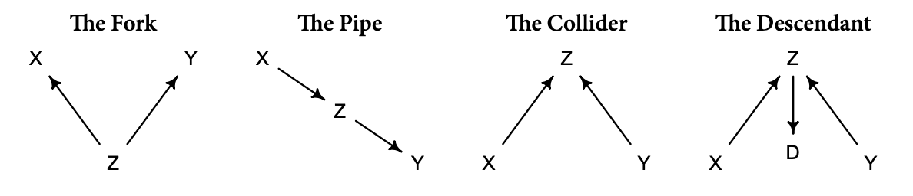
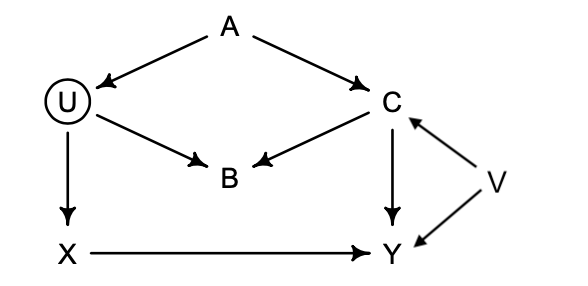
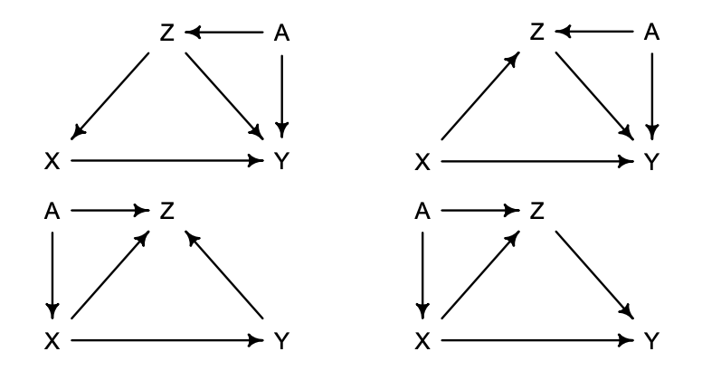

```{r setup, include=FALSE}
knitr::opts_chunk$set(echo = TRUE, warning = FALSE, message = FALSE, 
                      fig.asp = 0.621, fig.width = 8, out.width = "100%")
```

```{r warning=F, message=F, echo=F}
library(tidyverse)
library(rmdformats)
library(grid)
library(gridExtra)
library(rethinking)
library(dagitty)
```

# 5. kafli

## 5E1
Which of the linear models below are multiple linear regressions?

1. $\mu_i = \alpha + \beta x_i$
2. $\mu_i = \beta_x x_i + \beta_z z_i$
3. $\mu_i = \alpha + \beta(x_i - z_i)$
4. $\mu_i = \alpha  + \beta_x x_i + \beta_z z_i$

***
**Lausn**: (2) og (4) því þau innihalda margar spábreytur

## 5E2
Write down a multiple regression to evaluate the claim: *Animal diversity is linearly related to latitude, but only after controlling for plant diversity.* You just need to write down the model definition.

***
**Lausn**: Við getum ritað

$$
A_i \sim \mathrm{Normal}(\mu_i,\sigma) \\
\mu_i = \alpha + \beta_L L_i + \beta_P P_i 
$$
þar sem $A$ er *animal diversity*, $L$ er *latitude* og $P$ er *plant diversity*.

## 5E3
Write down a multiple regression to evaluate the claim: *Neither amount of funding nor size of laboratory is by itself a good predictor of time to PhD degree; but together these variables are both positively associated with time to degree.* Write down the model definition and indicate which side of zero each slope parameter should be on.

***
**Lausn**: Við getum ritað

$$
T_i \sim \mathrm{Normal}(\mu_i,\sigma) \\
\mu_i = \alpha + \beta_F F_i + \beta_L L_i
$$
þar sem $T$ er tíminn sem það tekur að fá doktorsgráðu, $F$ er fjármögnun, $L$ er stærð rannsóknarstofu og breyturnar $\beta_F$ og $\beta_L$ eru jákvæðar.

## 5E4
Suppose you have a single categorical predictor with 4 levels (unique values), labeled $A$, $B$, $C$
and $D$. Let $A_i$ be an indicator variable that is $1$ where case *i* is in category $A$. Also suppose $B_i$, $C_i$,
and $D_i$ for the other categories. Now which of the following linear models are inferentially equivalent
ways to include the categorical variable in a regression? Models are inferentially equivalent when it’s
possible to compute one posterior distribution from the posterior distribution of another model.

1. $\mu_i = \alpha + \beta_A A_i +  \beta_B B_i + \beta_D D_i$
2. $\mu_i = \alpha + \beta_A A_i + \beta_B B_i + \beta_C C_i + \beta_D D_i$
3. $\mu_i = \alpha + \beta_B B_i + + \beta_C C_i + \beta_D D_i$
4. $\mu_i = \alpha_A A_i + \alpha_B B_i + \alpha_C C_i + \alpha_D D_i$
5. $\mu_i = \alpha_A(1-B_i-C_i-D_i) + \alpha_B B_i + \alpha_C C_i + \alpha_D D_i$

***
**Lausn**: 

Módel 1 er með skurðpunkt fyrir flokk $C$ en hallatölu fyrir hina flokkana.

Módel 2 er með skurðpunkt og hallatölu fyrir alla flokkana. 

Módel 3 er með skurðpunkt fyrir flokk $A$ en hallatölu fyrir hina flokkana. 

Módel 4 er með hallatölu fyrir alla flokkana (og því skurðpunktinn $0$)

Módel 5 er í raun bara önnur leið til að skrifa módel 4 þar sem ef við höfum mælingu í flokki $A$ þá verður liðurinn $(1-B_i-C_i-D_i)=1$ en annars verður hann $0$ (rétt eins og $A_i$).

Því getum við ályktað að lokum að eina módelið sem stendur út úr er Módel 2 þar sem það inniheldur auka skurðpunkt. 
Módel 1, 3, 4 og 5 eru því "inferentially equivalent".

## 5M1
Invent your own example of a spurious correlation. An outcome variable should be correlated
with both predictor variables. But when both predictors are entered in the same model, the correlation
between the outcome and one of the predictors should mostly vanish (or at least be greatly reduced).

***
**Lausn**: Dæmi um þessa tegund af fylgni er jákvæða fylgnin á milli íssölu og drukknana í sjónum í ónefndu fylki í BNA eftir dögum. Hér er að sjálfsögðu önnur breyta sem útskýrir þetta en það er hversu gott veðrið er. 
Gott veður hefur jákvæð áhrif á sölu íss en gott veður hefur einnig þau áhrif að fleiri synda í sjónum og þar af leiðandi drukkna fleiri. Fjölda drukknana má því útskýra með veðrinu en veðrið útskýrir einnig íssöluna. Ef bæði íssala og veður er sett í módel sem spábreytur fyrir fjölda drukknana myndu tengsl milli íssölu og drukknana minnka töluvert.

## 5M2
Invent your own example of a masked relationship. An outcome variable should be correlated
with both predictor variables, but in opposite directions. And the two predictor variables should be
correlated with one another.

***
**Lausn**: Tökum sem dæmi samfélag lífvera þar sem matur er af skornum skammti. Því minni sem maturinn er því fleiri verða andlát en því fleiri sem lífverurnar eru því fleiri verða andlátin. Hér er því jákvæð fylgni milli fjölda lífvera og fjölda andláta en neikvæð fylgni milli magns af mat og fjölda andláta. En fjöldi lífvera og magn af mat eru tengdar breytur þar sem því fleiri sem lífverurnar eru, því minni verður maturinn (því þær þurfa meiri mat). Þetta er þá *"masked relationship"*.

## 5M3
It is sometimes observed that the best predictor of fire risk is the presence of firefighters—
States and localities with many firefighters also have more fires. Presumably firefighters do not cause
fires. Nevertheless, this is not a spurious correlation. Instead fires cause firefighters. Consider the
same reversal of causal inference in the context of the divorce and marriage data. How might a high
divorce rate cause a higher marriage rate? Can you think of a way to evaluate this relationship, using
multiple regression?

***
**Lausn**: Hærri skilnaðartíðni gæti orsakað hærri giftingartíðni þar sem að því fleiri sem skilja því fleiri eru einhleypir og tilbúnir í að gifta sig aftur. 

## 5M5
One way to reason through multiple causation hypotheses is to imagine detailed mechanisms
through which predictor variables may influence outcomes. For example, it is sometimes argued that
the price of gasoline (predictor variable) is positively associated with lower obesity rates (outcome
variable). However, there are at least two important mechanisms by which the price of gas could
reduce obesity. First, it could lead to less driving and therefore more exercise. Second, it could lead to
less driving, which leads to less eating out, which leads to less consumption of huge restaurant meals.
Can you outline one or more multiple regressions that address these two mechanisms? Assume you
can have any predictor data you need.

***
**Lausn**: Hér hefur hækkandi bensínverð neikvæð áhrif á keyrslu sem hefur jákvæð áhrif á hreyfingu sem hefur neikvæð áhrif á offitu. Við þurfum að búa til líkan sem inniheldur allar þessar spábreytur. Getum því t.d. ritað:

$$
O_i ∼ \text{Normal}(μ_i, σ) \\
\mu_i = \alpha  + \beta_B B_i + \beta_K K_i + \beta_H H_i
$$
þar sem við látum $B$ tákna bensínverð, $K$ tákna fjölda keyrðra kílómetra og $H$ fjölda klukkutíma sem einstaklingur hreyfir sig. $O$ táknar tíðni offitu.

# 6. kafli

## 6E1
List three mechanisms by which multiple regression can produce false inferences about causal
effects.

***
**Lausn**: *Multicollinearity*, *Post-treatment bias*, og *collider bias*.

## 6E2
For one of the mechanisms in the previous problem, provide an example of your choice, perhaps
from your own research.

***
**Lausn**: Dæmi um *multicollinearity* væri að spá fyrir um úthald með því að nota nokkrar spábreytur, þar á meðal hæð og þyngd. Þar sem hæð er ágætis spábreyta fyrir þyngd lendum við í veseni með *multicollinearity* við notkun þessa módels.

## 6E3
List the four elemental confounds. Can you explain the conditional dependencies of each?

***
**Lausn**: Hér má sjá mynd sem útskýrir *the four elemental confounds*.



Í *fork* er breytan $Z$ sameiginleg spábreyta $X$ og $Y$ og myndar þannig fylgni þar á milli. Ef við skilyrðum á $Z$, þá segir $X$ okkur ekkert um $Y$. $X$ og $Y$ eru óháð, skilyrt á $Z$.

Í *pipe* hefur breytan $X$ áhrif á $Z$ sem hefur áhrif á $Y$. Ef við skilyrðum á $Z$, getum við lokað leiðinni frá $X$ til $Y$. Eins og með *fork* eru $X$ og $Y$ óháðar, skilyrt á $Z$.

Ólíkt ofannefndum gerðum ruglara (e. confounds), eru engin tengls milli $X$ og $Y$ í *collider* nema skilyrt sé á $Z$. Skilyrðing á $Z$, collider-breytunni, opnar leiðina. Þegar leiðin er opin flæða upplýsingar milli $X$ og $Y$ en þær eru óháðar. 

*Descendant* er breyta undir áhrifum frá annarri breytu. Skilyrðing á afkomanda (e. descendant) skilyrðir að hluta til foreldrið ($Z$ á mynd). Ástæðan er sú að $D$ geymir upplýsingar um $Z$. Á myndinni mun þetta að hluta til opna leiðina frá $X$ til $Y$, þar sem $Z$ er *collider.* En almennt fer afleiðing skilyrðingar á afkomanda eftir eðli foreldris. Þessi tegund ruglara er algeng, því oft getum við ekki mælt breytu beint og höfum þess í stað aðeins einhvers konar fulltrúa fyrir hana.

## 6E4
How is a biased sample like conditioning on a collider? Think of the example at the open of the
chapter.

***
**Lausn**: Lítum á dæmið um sambandið milli "*trustworthy*" og "*newsworthy*". Þegar skilyrt er á greinum sem voru birtar (*collider*) virðist vera samband á milli þessara breyta. Eins virðist vera samband á milli þessara breyta ef við skoðum eingöngu þær greinar sem voru birtar (sem er "*biased sample*").

## 6M1
Modify the DAG on page *186* to include the variable $V$, an unobserved cause of $C$ and $Y$:
$C ← V → Y$. Reanalyze the DAG. How many paths connect $X$ to $Y$? Which must be closed? Which
variables should you condition on now?

***
**Lausn**: Hér má sjá breytt DAG. 



Á myndinni má sjá  nokkrar leiðir á milli $X$ og $Y$. Þær eru:
$$
1) \quad X \rightarrow Y \\
2) \quad X \leftarrow U \leftarrow A \rightarrow C \rightarrow Y \\
3) \quad X \leftarrow U \rightarrow B \leftarrow C \rightarrow Y \\
4) \quad X \leftarrow U \leftarrow A \rightarrow C \leftarrow V \rightarrow Y \\
5) \quad X \leftarrow U \rightarrow B \leftarrow C \leftarrow V \rightarrow Y \\
$$

Þær leiðir sem eru opnar (og þarf að loka) eru leiðir $2$ og $4$. Til þess að loka þessum leiðum væri best að skilyrða á breytunni $A$.

Við getum notað kóðann hér að neðan til þess að sannreyna þetta.

```{r}
dag_1 <- dagitty( "dag {
U [unobserved]
V [unobserved]
X -> Y
X <- U <- A -> C -> Y 
U -> B <- C
C <- V -> Y
}")
adjustmentSets( dag_1 , exposure="X" , outcome="Y" )
```

Niðurstaðan staðfestir þetta.

## 6M2
Sometimes, in order to avoid multicollinearity, people inspect pairwise correlations among
predictors before including them in a model. This is a bad procedure, because what matters is the
conditional association, not the association before the variables are included in the model. To highlight
this, consider the DAG $X → Z → Y$. Simulate data from this DAG so that the correlation
between X and Z is very large. Then include both in a model prediction Y. Do you observe any
multicollinearity? Why or why not? What is different from the legs example in the chapter?

***
**Lausn**: Sjáum hvernig hermdu gögnin eru gerð hér að neðan.

```{r}
set.seed(9)
n <- 100
x <- rnorm(n , mean=1 , sd=2)
r <- 0.9
z <- rnorm(n , mean=r*x , sd=1.2)
r <- 0.75
y <- rnorm(n , mean=r*z, sd=1.7)

model_1 <- lm(y ~ x + z)
model_2 <- lm(y ~ x)
model_3 <- lm(y ~ z)
par(mfrow=c(2,2))
precis(model_1) %>% plot()
precis(model_2) %>% plot()
precis(model_3) %>% plot()

post <- extract.samples(model_1)
plot(x ~ z , post , col=col.alpha(rangi2,0.1) , pch=16)
```

Eins og sést á myndinni af módelinu með bæði $x$ og $z$ sem spábreytur (myndin efst til vinstri) er $0$ inni í öryggisbilinu fyrir $x$ og má því álykta að $x$ hefur ekki marktæk áhrif. En $z$ hefur augljóslega áhrif á $y$. 

Þabnnig að þegar $z$ *er ekki* inni í módelinu hefur $x$ áhrif á $y$ en þegar $z$ *er* í módelinu hverfa áhrif $x$. 

Á myndinni neðst til hægri sjáum við merki um multicollinearity (sem kemur ekki á óvart) en ef við höfum $z$ líka inni í módelinu þegar við notum $x$ sem spábreytu veldur það ekki vandamáli. 

Ef við berum þetta saman við fótleggjadæmið þá er helsti munurinn sá að niðurstaðan í fótleggjadæminu, þegar báðir leggirnir voru notaðir sem spábreytur í módelinu, bendir til þess að hvorug breytan hafi marktæk áhrif á hæð. Niðurstaðan úr okkar dæmi bendir til þess að $z$ hafi áhrif en ekki $x$. Þetta gæti stafað af sambandinu milli breytanna.

## 6M3
Learning to analyze DAGs requires practice. For each of the four DAGs below, state which variables, if any, you must adjust for (condition on) to estimate the total causal influence of $X$ on $Y$.



***
**Lausn**: Skoðum myndirnar frá vinstri til hægri, frá efri línu til neðri línu. 

Á mynd 1 er nóg að skilyrða á $Z$ þar sem við höfum fork.

Á mynd 2 þarf að skilyrða á bæði $Z$ og $A$ (þar sem $Z$ er bæði collider og pipe og því þarf líka að skilyrða á $A$).

Á mynd 3 þarf ekki að skilyrða á neinum breytum þar sem $Z$ er collider í öllum leiðum.

Á mynd 4 er nóg að skilyrða á $Z$ sem er bæði collider og pipe en með því að skilyrða á henni lokast leiðin frá $A$ til $Y$. Þá opnast leiðin frá $A$ til $X$ en það hefur engin áhrif á verkefnið.

# 7. kafli

## 7E1
State the three motivating criteria that define information entropy. Try to express each in your own words.

***
**Lausn**:

1. Óvissumat á að vera samfellt

2. Óvissumat á að aukast þegar fjöldi mögulegra atburða eykst

3. Óvissumat á að vera samleggjandi (e. additive)

## 7E2
Suppose a coin is weighted such that, when it is tossed and lands on a table, it comes up heads 70% of the time. What is the entropy of this coin?

***
**Lausn**: Höfum skv. jöfnu:

$$
H(p) = - \sum_{i=1}^n p_i \log(p_i) = -p_1 \cdot \log(p_1) - p_2 \cdot \log(p_2) = -0.7 \cdot \log(0.7) - 0.3 \cdot \log(0.3) \approx 0.6108643
$$
```{r}
-0.7*log(0.7)-0.3*log(0.3)
```

## 7E3
Suppose a four-sided die is loaded such that, when tossed onto a table, it shows “1” 20%, “2” 25%, “3” 25%, and “4” 30% of the time. What is the entropy of this die?

***
**Lausn**: Fáum á sama hátt og áður:

$$
H(p) = - \sum_{i=1}^n p_i \log(p_i) = -0.2 \cdot \log(0.2) - 0.25 \cdot \log(0.25) -0.25 \cdot \log(0.25) -0.3 \cdot \log(0.3) \approx 1.376227
$$

```{r}
-0.2*log(0.2)-0.25*log(0.25)-0.25*log(0.25)-0.3*log(0.3)
```

## 7E4
Suppose another four-sided die is loaded such that it never shows “4”. The other three sides show equally often. What is the entropy of this die?

***
**Lausn**: Fáum á sama hátt og áður:

$$
H(p) = - \sum_{i=1}^n p_i \log(p_i) \\ = -\frac{1}{3} \cdot \log(\frac{1}{3}) - \frac{1}{3} \cdot \log(\frac{1}{3}) -\frac{1}{3} \cdot \log(\frac{1}{3}) -0 \\ = - 1 \cdot \log(\frac{1}{3}) \approx 1.098612
$$

```{r}
-1*log(1/3)
```

## 7M1
Write down and compare the definitions of AIC and WAIC. Which of these criteria is most general? Which assumptions are required to transform the more general criterion into a less general one?

***
**Lausn**: 

*AIC* er táknað með eftirfarandi formúlu um frávik utan úrtaks:

$$
\text{AIC}=D_{train}+2p \\ = -2\text{lppd} +2p
$$

þar sem $p$ er fjöldi breyta og lppd er *"log-pointwise-predictive-density"*. Kosturinn við *AIC* er að formúlan er einföld en *AIC* er sjaldan notað nú til dags þar sem að gildið er ekki áreiðanlegt nema ákveðnar forsendur um "priors", "posterior" dreifingu og hlutfall milli úrtaksstærðar og fjölda breyta séu uppfylltar. Þetta veldur því að *AIC* er ekki jafn almennt og ákjósanlegt væri.

*WAIC* er almennara en *AIC* þar sem engar sérstakar kröfur eru gerðar um lögun "posterior". Að neðan má sjá formúluna fyrir *WAIC*:
$$
\text{WAIC}(y, \Theta)=-2\left(\text{lppd}-\sum_i \text{var}_\theta \log p(y_i|\theta)\right)
$$

þar sem $y$ er mælingin og $Θ$ er "posterior" dreifingin.

## 7M2
Explain the difference between model selection and model comparison. What information is lost under model selection?

***
**Lausn** (á ensku þar sem sum orðin er erfitt að þýða): 

Model selection compares models, chooses the one with the lowest criterion value (i.e. WAIC) and then discards the other models. Model comparison does not choose one model but uses multiple models to infer how different variables influence predictions. Additionally the implied conditional independencies among the variables can help infer causal relationships between the variables.

When model selection is used we loose valuable information about the differences between the model accuracies, which means we don’t know how confident to be in our model. This method also might loose reliable parameter interpretations on causal inference between variables.

## 7M3
When comparing models with an information criterion, why must all models be fit to exactly the same observations? What would happen to the information criterion values, if the models were fit to different numbers of observations? Perform some experiments, if you are not sure.

***
**Lausn**: 

Notum kóðann hér að neðan til þess að skoða hvernig *WAIC* breytist þegar módel er fittað við mismunandi mælingar (og mismunandi fjölda mælinga)

Notum gagnasafnið *cars* og byrjum á að skipta því handahófskennt í tvö jafn stór gagnasöfn.

```{r}
set.seed(1)
data(cars) 
d1 <- cars[sample(25),]
m <- quap(alist(
  dist ~ dnorm(mu,sigma), mu <- a + b*speed,
  a ~ dnorm(0,100),
  b ~ dnorm(0,10),
  sigma ~ dexp(1) ) , 
  data=d1)

WAIC(m)
```

```{r}
set.seed(100)
d2 <- cars[sample(25),]
m <- quap(alist(
  dist ~ dnorm(mu,sigma), mu <- a + b*speed,
  a ~ dnorm(0,100),
  b ~ dnorm(0,10),
  sigma ~ dexp(1) ), data=d2)

WAIC(m)
```

Sjáum að *WAIC* gildið er ólíkt en samt sem áður nokkuð líkt milli módela. Óáreiðanlegt er að bera saman módel sem eru fittuð á ólík úrtök þar sem hver einstök mæling hefur sitt eigið "penalty term" og "lppd" í *WAIC*.

Athugum nú hvað gerist ef úrtaksstærðin er ólík. Þetta er nákvæmlega sami kóði og áður nema búið er að stækka úrtaksstærðina í fyrra módelinu en minnka í seinna.

```{r}
set.seed(1)
data(cars) 
d1 <- cars[sample(35),]
m <- quap(alist(
  dist ~ dnorm(mu,sigma), 
  mu <- a + b*speed,
  a ~ dnorm(0,100),
  b ~ dnorm(0,10),
  sigma ~ dexp(1)), 
  data=d1)

WAIC(m)
```

```{r}
set.seed(2)
d2 <- cars[sample(15),]
m <- quap(alist(
  dist ~ dnorm(mu,sigma), 
  mu <- a + b*speed,
  a ~ dnorm(0,100),
  b ~ dnorm(0,10),
  sigma ~ dexp(1) ), 
  data=d2)
WAIC(m)
```

Sjáum nú að talvert meiri munur er á *WAIC* gildum milli módela. Fleiri mælingar gefa okkur hærra *WAIC* gildi þar sem frávik mælinganna eru lögð saman og þannig gefa fleiri mælingar okkur hærri summu. 

## 7M4
What happens to the effective number of parameters, as measured by *PSIS* or *WAIC*, as a prior
becomes more concentrated? Why? Perform some experiments, if you are not sure.

***
**Lausn**: Let's look at an example using the *cars* data again.

Here we see the code with the same priors as before
```{r}
set.seed(1)
d <- cars
m <- quap(alist(
  dist ~ dnorm(mu, sigma), 
  mu <- a + b*speed,
  a ~ dnorm(0, 100),
  b ~ dnorm(0, 10),
  sigma ~ dexp(1)), 
  data=d)
WAIC(m)
PSIS(m)
```
Now let's see what happens when we make the priors more concentrated.

```{r}
m <- quap(alist(
  dist ~ dnorm(mu, sigma), 
  mu <- a + b*speed,
  a ~ dnorm(0, 0.1), # More concentrated priors
  b ~ dnorm(0, 0.1), # More concentrated priors
  sigma ~ dexp(1)), 
  data=d)
WAIC(m)
PSIS(m)
precis(m)
```

*The effective number of parameters* or *the penalty term* is lower when the priors are more concentrated. 

## 7M5
Provide an informal explanation of why informative priors reduce overfitting.

***
**Lausn**: "informative priors" takmarka hversu mikið extreme gildi geta haft áhrif á módelið, þ.e. þeir takmarka hversu mikið módelið getur lært af gögnunum og þannig hafa sérstakar mælingar ekki alltof mikil áhrif á fittið.

## 7M6
Provide an informal explanation of why overly informative priors result in underfitting.

***
**Lausn**: Of "informative priors" takmarka of mikið getu módelsins til að læra af gögnunum og þannig er ólíklegra að eðlileg og góð gildi nái að hafa nógu mikil áhrif á fittið sem passar þá of illa við gögnin. 

Þannig ef við skoðum bæði 7M5 og 7M6 saman sjáum við að það er mikilvægt að nota "informative priors" en það er mikilvægt að hafa þá ekki "of informative".
