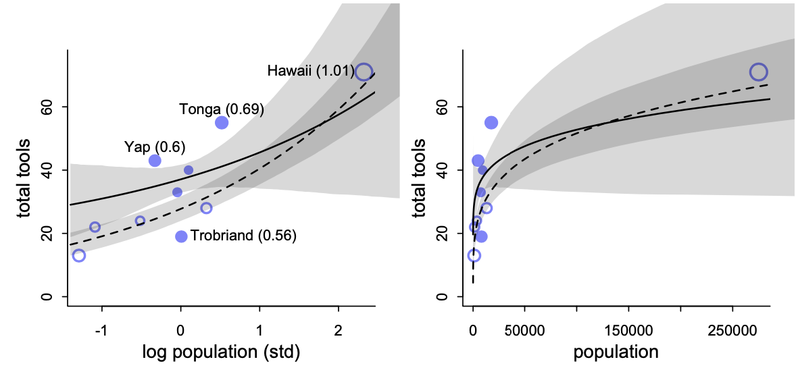
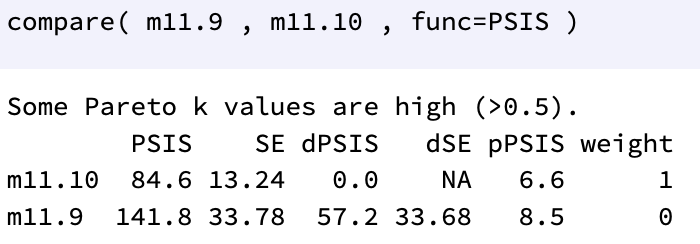

```{r setup, include=FALSE}
knitr::opts_chunk$set(echo = TRUE, warning = FALSE, message = FALSE, 
                      fig.asp = 0.621, fig.width = 8, out.width = "100%")
```

```{r warning=F, message=F, echo=F}
library(tidyverse)
library(rmdformats)
library(grid)
library(gridExtra)
library(rethinking)
library(dagitty)
library(kableExtra)
```

# 9. kafli

## 9E3
Which sort of parameters can Hamiltonian Monte Carlo not handle? Can you explain why?

***
**Lausn**: HMC cannot handle discrete parameters. It can’t glide through a discrete parameter, it needs a continous surface.

## 9E4
Explain the difference between the effective number of samples, `n_eff` as calculated by Stan, and the actual number of samples.

***
**Lausn**: The effective number of samples is an estimate of the number of independent samples from the posterior distribution, in terms of estimating some function like the posterior mean. I.e. given dependent samples, the number of independent samples is replaced with the effective sample size  $n_{eff}$, which is the number of independent samples with the same estimation power as the $n$ autocorrelated samples (actual number of samples).


## 9E5
Which value should `Rhat` approach, when a chain is sampling the posterior distribution correctly?

***
**Lausn**: It should approach 1 from above.


## 9E6
Sketch a good trace plot for a Markov chain, one that is effectively sampling from the posterior distribution. What is good about its shape? Then sketch a trace plot for a malfunctioning Markov chain. What about its shape indicates malfunction?

***
**Lausn**: Let's use the model `m9.1` from the book to show an example of a good trace plot.

```{r, message=FALSE, warning=FALSE, results="hide"}
data(rugged)
d <- rugged
d$log_gdp <- log(d$rgdppc_2000)
dd <- d[complete.cases(d$rgdppc_2000),] 
dd$log_gdp_std <- dd$log_gdp/mean(dd$log_gdp) 
dd$rugged_std <- dd$rugged/max(dd$rugged) 
dd$cid <- ifelse(dd$cont_africa==1, 1, 2)

dat_slim <- list(
  log_gdp_std = dd$log_gdp_std, 
  rugged_std = dd$rugged_std, 
  cid = as.integer(dd$cid)
)

set.seed(11)
m9.1 <- ulam(alist(
  log_gdp_std ~ dnorm(mu, sigma),
  mu <- a[cid] + b[cid]*(rugged_std - 0.215), 
  a[cid] ~ dnorm(1, 0.1),
  b[cid] ~ dnorm(0, 0.3),
  sigma ~ dexp(1)
), data=dat_slim, chains=1)
```

```{r}
precis(m9.1 , depth=2)
traceplot(m9.1)
```

What's good about this Markov chain is that it is both stationary and well-mixing.

Now let's use the model `m9.2` from the book to show an example of a bad trace plot.

```{r, message=FALSE, warning=FALSE, results="hide"}
y <- c(-1,1) 
set.seed(11) 
m9.2 <- ulam(
  alist(
  y ~ dnorm(mu, sigma),
  mu <- alpha,
  alpha ~ dnorm(0, 1000), 
  sigma ~ dexp(0.0001)
), data=list(y=y), chains=3)
```

```{r}
precis(m9.2)
traceplot(m9.2)
```


This Morkov chain is not stationary or well-mixing.

## 9M1
Re-estimate the terrain ruggedness model from the chapter, but now using a uniform prior
for the standard deviation, sigma. The uniform prior should be `dunif(0,1)`. Use `ulam` to estimate the posterior. Does the different prior have any detectible influence on the posterior distribution of sigma? Why or why not?

***
**Lausn**: Here we see the model with this prior for sigma.

```{r, message=FALSE, warning=FALSE, results="hide"}
set.seed(11)
m9.1_new <- ulam(alist(
  log_gdp_std ~ dnorm(mu, sigma),
  mu <- a[cid] + b[cid]*(rugged_std - 0.215), 
  a[cid] ~ dnorm(1, 0.1),
  b[cid] ~ dnorm(0, 0.3),
  sigma ~ dunif(0,1) #modified
), data=dat_slim, chains=1)
```

```{r}
precis(m9.1_new , depth=2)
traceplot(m9.1_new)
```

```{r}
sigma_exp <- extract.samples(m9.1,pars="sigma")
sigma_unif <- extract.samples(m9.1_new,pars="sigma") 
dens(sigma_exp[[1]], col="dodgerblue")
dens(sigma_unif[[1]], add=T, col="indianred3")
```

We see from the plot above (and the output from `precis`) that the posterior distributions are very similar. That might be because the data has a lot of observations while the difference between the priors is not very big.

## 9M2
Modify the terrain ruggedness model again. This time, change the prior for b[cid] to dexp(0.3). What does this do to the posterior distribution? Can you explain it?

***
**Lausn**: Here we see the model with this prior for b[cid].

```{r, message=FALSE, warning=FALSE, results="hide"}
set.seed(9)
m9.1_new2 <- ulam(alist(
  log_gdp_std ~ dnorm(mu, sigma),
  mu <- a[cid] + b[cid]*(rugged_std - 0.215), 
  a[cid] ~ dnorm(1, 0.1),
  b[cid] ~ dexp(0.3), #modified
  sigma ~ dexp(1)
), data=dat_slim, chains=1)
```

```{r}
precis(m9.1_new2 , depth=2)
traceplot(m9.1_new2)
```

```{r}
b_old <- extract.samples(m9.1, pars="b")
b_new <- extract.samples(m9.1_new2, pars="b")

dens(b_new[[1]], col="indianred3")
dens(b_old[[1]], add=T, col="dodgerblue")
```

Now we see that there is a big difference in the posterior distribution. That might be because the difference in priors is very strong.

## 9M3
Re-estimate one of the Stan models from the chapter, but at different numbers of warmup iterations. Be sure to use the same number of sampling iterations in each case. Compare the $n_{eff}$ values. How much warmup is enough?


***
**Lausn**: Notum aftur líkan `m9.1`.

```{r, results="hide"}
# Different numbers of warmup iterations
warm_ups <- c(1, 7, 15, 50, 100, 500, 1000)

# Data frame sem geymir n_eff gildin
n_effs <- data.frame("warmup"=warm_ups, "a1"=rep(NA, length(warm_ups)), "a2"=rep(NA, length(warm_ups)), "b1"=rep(NA, length(warm_ups)), "b2"=rep(NA, length(warm_ups)), "sigma"=rep(NA, length(warm_ups)))

# Fylla inn í n_effs með resampling og precis.
for (i in 1:length(warm_ups)){
  m_tmp <- ulam(alist(
  log_gdp_std ~ dnorm(mu, sigma),
  mu <- a[cid] + b[cid]*(rugged_std - 0.215), 
  a[cid] ~ dnorm(1, 0.1),
  b[cid] ~ dnorm(0, 0.3),
  sigma ~ dexp(1)
  ), data=dat_slim, chains=1, iter=1000+warm_ups[i], warmup=warm_ups[i])
  precis_tmp <- precis(m_tmp, depth = 2)
  precis_tmp
  n_effs[i,2:6] <- precis_tmp$n_eff
}
```

```{r}
n_effs %>% tibble() %>% kable(col.names = c("warmup", row.names(precis_tmp))) %>% kable_styling(bootstrap_options = "striped", full_width = FALSE) %>% column_spec(1, bold = T)

colors <- c("a1"="dodgerblue", "a2"="royalblue3", "b1"="indianred3", "b2"="indianred4", "sigma"="goldenrod3")

ggplot(aes(x=warmup), data=n_effs) + 
  geom_line(aes(y = a1, color = "a1")) + 
  geom_line(aes(y = a2, color = "a2")) + 
  geom_line(aes(y = b1, color = "b1")) + 
  geom_line(aes(y = b2, color = "b2")) + 
  geom_line(aes(y = sigma, color = "sigma")) + 
  scale_x_continuous(breaks=warm_ups) + 
  labs(x="warmup", y="n_eff", color="Legend") + 
  scale_color_manual(values = colors)
```

Erfitt er að meta hvaða gildi fyrir warmup er nóg fyrir þessi gögn yfir alla stikana. 
Warmup gildi í kringum $500$ virðist vera hápunktur fyrir `b[1]`, `b[2]` og `sigma` en fyrir `a[1]` og `a[2]` sjáum við topp milli gildanna $50$ og $100$ en svo virðist skilvirknin (e. efficiency) bætast enn meira við warmup gildið $1000$. 

Þó má einnig sjá að skilvirknin er mikil í gildinu $15$ fyrir alla stikana svo kannski er skynsamlegt að velja það warmup gildi.

# 11. kafli

## 11E1
If an event has probability $0.35$, what are the log-odds of this event?

***
**Lausn**: Ef probability$=p$ fáum við log-odds út frá jöfnunni

$$
\log \left( \frac{p}{1-p} \right)
$$

En þá fæst fyrir $p=0.35$:

```{r}
p <- 0.35
log(p/(1-p))
```


## 11E2
If an event has log-odds $3.2$, what is the probability of this event?

***
**Lausn**: Notum fallið `inv_logit` úr `rethinking` pakkanum en það reiknar einmitt þetta.

```{r}
inv_logit(3.2)
```
Þ.a. $p=$ `r round(inv_logit(3.2), 3)`

## 11E3
Suppose that a coefficient in a logistic regression has value $1.7$. What does this imply about the proportional change in odds of the outcome?

***
**Lausn**: We can calculate the proportional change in odds by simply exponentiating the parameter of interest:

```{r}
exp(1.7)
```

The new odds are calculated by taking the old odds and multiplying them by the proportional odds. So when the predictor increases by 1, the odds are multiplied by `r round(exp(1.7), 2)`

## 11E4
Why do Poisson regressions sometimes require the use of an offset? Provide an example.

***
**Lausn**: Tökum sem dæmi fjölda fólks sem heimsækir búð sem er með tvö útibú, annars vegar í Kringlunni en hins vegar á Laugavegi. Fjöldinn er mældur á hverjum klukkutíma í Kringlunni en daglega á Laugavegi. Til þess að geta borið þessar tölur saman í sama módeli þurfum við *offset*.

## 11M2
If a coefficient in a Poisson regression has value $1.7$, what does this imply about the change in the outcome?

***
**Lausn**: Höfum:

$$
\log(\lambda)=\alpha + \beta x \quad \text{þ.e.} \\ 
\lambda = \exp(\alpha + \beta x), \\

$$
þar sem $\beta=1.7$. Þá fæst:

$$
\frac{\lambda_{x+1}}{\lambda_{x}}=\frac{\exp(\alpha+\beta (x+1))}{\exp(\alpha + \beta x)} = \exp(\beta) = \exp(1.7) = 5.473947
$$

Þannig að þegar $x$ (predictor) hækkar um $1$ þá hækkar útkoman (væntigildið) um $5.5$.

## 11M3
Explain why the logit link is appropriate for a binomial generalized linear model.

***
**Lausn**: The logit link maps a parameter that is defined as a probability mass, and therefore constrained to lie between zero and one, onto a linear model that can take on any real value. This link is extremely common when working with binomial GLMs since the parameters are defined as a probability mass in that model.

## 11M4
Explain why the log link is appropriate for a Poisson generalized linear model.

***
**Lausn**: The log link function maps a parameter that is defined over only positive real values onto a linear model. A log link is both conventional and useful in a situation where we need to prevent the parameters from taking a negative value (like in a Poisson GLM)

## 11M5
What would it imply to use a logit link for the mean of a Poisson generalized linear model? Can you think of a real research problem for which this would make sense?

***
**Lausn**: Skrifum upp slíkt módel.

$$
y_i \sim \text{Poisson}(\mu_i) \\
\text{logit}(\mu_i) = \log \left( \frac{\mu_i}{1-\mu_i} \right) =\alpha + \beta x_i
$$

Þetta hefur þau áhrif að $\mu$ þarf að vera milli $0$ og $1$ en þetta myndi þá stöðva veldisvísisvöxtinn. Þetta gæti því verið hentugt í slíkum tilfellum en mér dettur ekkert sérstakt dæmi í hug.

## 11M6
State the constraints for which the binomial and Poisson distributions have maximum entropy. Are the constraints different at all for binomial and Poisson? Why or why not?

***
**Lausn**: Since the Poisson distribution is just a special case of the binomial distribution the constraints are the same; 

(1) only two unordered events, and 

(2) constant expected value

## 11M8
Revisit the `data(Kline)` islands example. This time drop Hawaii from the sample and refit
the models. What changes do you observe?

***
**Lausn**: Notum kóðann hér að neðan til þess að framkvæma umbeðnar breytingar

```{r, results="Hide"}
data(Kline)
d <- Kline
d <- d %>% filter(culture != "Hawaii")
d$P <- scale(log(d$population))
d$contact_id <- ifelse(d$contact=="high", 2, 1)

dat <- list(
  Tools = d$total_tools, 
  P =  d$P,
  cid = d$contact_id)

# intercept only 
m11.9 <- ulam(
  alist(
    Tools ~ dpois(lambda), 
    log(lambda) <- a,
    a ~ dnorm(3, 0.5)
  ), data=dat, chains=4, log_lik=TRUE )

# interaction model 
m11.10 <- ulam(
  alist(
    Tools ~ dpois( lambda ),
    log(lambda) <- a[cid] + b[cid]*P, a[cid] ~ dnorm(3, 0.5), 
    b[cid] ~ dnorm(0, 0.2)
  ), data=dat, chains=4, log_lik=TRUE )
```

Berum nú módelin saman og teiknum mynd sem er sambærileg Figure 11.9 í bókinni.

```{r}
compare(m11.9, m11.10, func=PSIS)

k <- PSIS(m11.10, pointwise=TRUE)$k
par(mfrow=c(1,2))

plot(dat$P, dat$Tools , xlab="log population (std)", ylab="total tools", col=rangi2, pch=ifelse(dat$cid==1, 1, 16), lwd=2, ylim=c(0,75) , cex=1+normalize(k))

# set up the horizontal axis values to compute predictions at 
ns <- 100
P_seq <- seq( from=-1.4 , to=3 , length.out=ns )

# predictions for cid=1 (low contact)
lambda <- link(m11.10, data=data.frame(P=P_seq, cid=1)) 
lmu <- apply(lambda, 2, mean)
lci <- apply(lambda, 2, PI)
lines(P_seq, lmu, lty=2, lwd=1.5)
shade(lci, P_seq, xpd=TRUE)

# predictions for cid=2 (high contact)
lambda <- link(m11.10, data=data.frame(P=P_seq, cid=2)) 
lmu <- apply(lambda, 2, mean)
lci <- apply(lambda, 2, PI)
lines(P_seq, lmu, lty=1, lwd=1.5)
shade(lci, P_seq, xpd=TRUE)

# Natural scale
plot(d$population, d$total_tools, xlab="population", ylab="total tools", col=rangi2, pch=ifelse(dat$cid==1, 1, 16), lwd=2, ylim=c(0, 75), cex=1+normalize(k))
ns <- 100
P_seq <- seq(from= -5, to=3, length.out=ns) 
# 0.9382112 is sd of log(population)
# 8.582836 is mean of log(population)
pop_seq <- exp(P_seq*0.9382112 + 8.582836)
lambda <- link(m11.10, data=data.frame(P=P_seq, cid=1)) 
lmu <- apply(lambda, 2, mean)
lci <- apply(lambda, 2, PI)
lines(pop_seq, lmu, lty=2, lwd=1.5) 
shade(lci, pop_seq, xpd=TRUE)

lambda <- link(m11.10, data=data.frame(P=P_seq, cid=2)) 
lmu <- apply(lambda, 2, mean)
lci <- apply(lambda, 2, PI)
lines(pop_seq, lmu, lty=1, lwd=1.5)
shade(lci, pop_seq, xpd=TRUE)
```

Að neðan sjáum við Figure 11.9 úr bókinni þar sem Hawaii er í gögnunum. Auk þess sjáum við útkomu `compare` fyrir þau módel.





Augljósasta breytingin er sú að í okkar módeli er punktalínan alltaf fyrir neðan fylltu línuna. Einnig fáum við ekki viðvörunina um að "Some Pareto k values are high (>0.5)." og `pPSIS` (effective number of parameters) er núna hærra fyrir módelið með fleiri stikum eins og við viljum. Auk þess er `PSIS` lægra fyrir módelið með fleiri stikum eins og við viljum. 

Hawaii er mjög sérstök mæling í þessum gögnum sem hefur því mikil áhrif á fittið. Skemmtilegt væri að nota gögn með fleiri mælingum.

# 12. kafli

## 12E4
Over-dispersion is common in count data. Give an example of a natural process that might
produce over-dispersed counts. Can you also give an example of a process that might produce underdispersed counts?

***
**Lausn**: Dæmi gögn þar sem "over-dispersion" gæti komið upp eru gögn um fjölda viðskiptavina matvörubúða daglega. 

Þar er önnur breyta sem þyrfti að taka með í reikninginn. Sumar matvörubúðir eru stærri og vinsælli en aðrar og fá að meðaltali fleiri fjölda viðskiptavina á dag. 

## 12H1
In 2014, a paper was published that was entitled “Female hurricanes are deadlier than male
hurricanes.” As the title suggests, the paper claimed that hurricanes with female names have caused greater loss of life, and the explanation given is that people unconsciously rate female hurricanes as less dangerous and so are less likely to evacuate. Statisticians severely criticized the paper after publication. Here, you’ll explore the complete data used in the paper and consider the hypothesis that hurricanes with female names are deadlier. Load the data with:

```{r}
library(rethinking) 
data(Hurricanes)
```

Acquaint yourself with the columns by inspecting the help `?Hurricanes`. In this problem, you’ll focus on predicting deaths using femininity of each hurricane’s name. Fit and interpret the simplest possible model, a Poisson model of deaths using femininity as a predictor. You can use quap or ulam. Compare the model to an intercept-only Poisson model of deaths. How strong is the association between femininity of name and deaths? Which storms does the model fit (retrodict) well? Which storms does it fit poorly?

***
**Lausn**: Lesum inn gögnin, stöðlum femininity og setjum svo upp einfalt módel.

```{r}
dat <- Hurricanes
dat$femininity_std <- (dat$femininity-mean(dat$femininity))/sd(dat$femininity)

fit_simple <- quap(
  alist(
    deaths ~ dpois(lambda), 
    log(lambda) <- a + b*femininity_std, 
    a ~ dnorm(0, 10),
    b ~ dnorm(0, 10)
  ), data=dat
)

precis(fit_simple)

fit_intercept <- quap(
  alist(
    deaths ~ dpois(lambda), 
    log(lambda) <- a,
    a ~ dnorm(0, 10)
  ), data=dat
)

precis(fit_intercept)
compare(fit_simple, fit_intercept)
```

Sjaum af úttaki `precis` og `compare` að svo virðist sem það sé jákvæð fylgni milli kveinleika nafns og fjölda dauða og að módelið með kveinleikabreytunni er betra heldur en módelið sem inniheldur eingöngu skurðpunkt. Athugum þetta betur.

Teiknum upp gögnin auk `fit_simple` með öryggisbili.

```{r}
post <- extract.samples(fit_simple)
a_map <- mean(post$a)
b_map <- mean(post$b)

lower <- exp(PI(post$a)[1] + PI(post$b)[1]*dat$femininity_std)
upper <- exp(PI(post$a)[2] + PI(post$b)[2]*dat$femininity_std)

ggplot(dat, aes(femininity_std, deaths)) + geom_point() +
  stat_function(color="indianred3", fun=function(x) exp(a_map + b_map*x)) +  geom_ribbon(aes(ymin=lower, ymax=upper, x=femininity_std), alpha=0.05)
```

Sjáum af myndinni að lang flestir punktarnir liggja utan öryggisbilsins. Dreifnin í gögnunum er mikil og kvenleiki nafns útskýrir mjög lítið af dreifni breytunnar `deaths`.

Módelið passar vel fyrir mjög fáa fellibyli. 

## 12H2
Counts are nearly always over-dispersed relative to Poisson. So fit a gamma-Poisson (aka
negative-binomial) model to predict deaths using femininity. Show that the over-dispersed model no longer shows as precise a positive association between femininity and deaths, with an 89% interval that overlaps zero. Can you explain why the association diminished in strength?

***
**Lausn**: Setjum módelið upp og berum svo saman við módelið úr dæmi 12H1.

```{r}
fit_simple2 <- quap(
  alist(
    deaths ~ dgampois(lambda, phi), 
    log(lambda) <- a + b*femininity_std, 
    a ~ dnorm(0, 10),
    b ~ dnorm(0, 10),
    phi ~ dexp(1)
  ), data=dat
)

precis(fit_simple2)
plot(coeftab(fit_simple, fit_simple2) , pars=c("a","b"))
```

Sjáum að óvissan er talsvert meiri í þessu módeli og nær því öryggisbilið fyrir `b` yfir $0$. Teiknum aftur upp gögnin með þessu módeli.

```{r}
post2 <- extract.samples(fit_simple2)
a_map2 <- mean(post2$a)
b_map2 <- mean(post2$b)

lower2 <- exp(PI(post2$a)[1] + PI(post2$b)[1]*dat$femininity_std)
upper2 <- exp(PI(post2$a)[2] + PI(post2$b)[2]*dat$femininity_std)

ggplot(dat, aes(x=femininity_std, y=deaths)) + geom_point() +
  stat_function(color="indianred3", fun=function(x) exp(a_map2 + b_map2*x)) +  geom_ribbon(aes(ymin=lower2, ymax=upper2, x=femininity_std), alpha=0.11)
```

Þessi mynd sýnir aðeins stærra öryggisbil en samt eru flestir punktarnir utan þess. Sjáum líka að hallinn á línunni er mjög lítill.

Ástæðan fyrir þessum muni á 12H1 og 12H2 (Poisson vs. gamma-Poisson) er sú að gamma-Poisson módelið inniheldur stikann `phi` sem hefur þau áhrif dreifnin getur orðið meiri og þannig getur hver fellibylur haft eigið væntigildi dauða.
